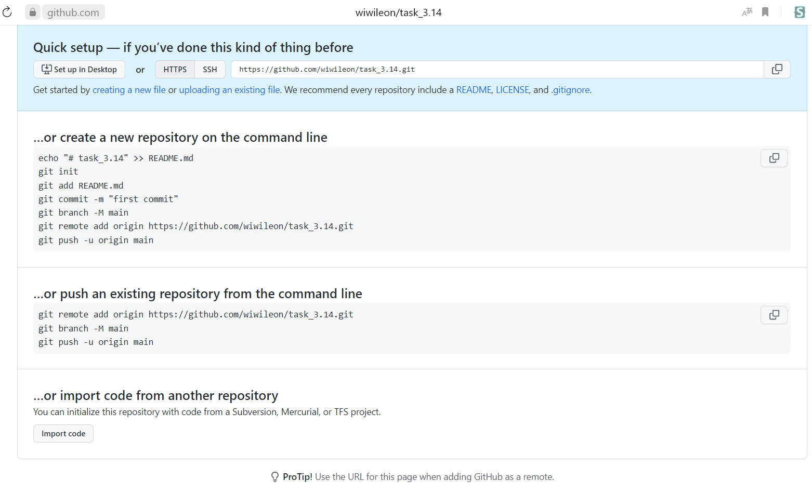

[< к содержанию](./readme.md)

## Короткая сводка команд

---

1. Создание локальной копии главного репозитория: 

```bash=
git clone https://github.com/ваш_user.name/test
cd test  //не забыть перейти в каталог репозитория
```

2. Добавление новых файлов в репозиторий.<br>
Избранные файлы:

```bash=
git add file1 file2 file3
```

Все новые файлы: 

```bash=
git add .
```

3. Сохранение изменений файлов: 

```bash=
git commit ­am "commit description" 
```
4. Получение изменений из главного репозитория: 

```bash=
git pull
```

5. Отправка изменений в главный репозиторий (с авторазрешением конфликтов): 

```bash=
git pull //проверить на наличие новых изменений в репозитории и, если  они есть, выкачать их и объединить с локальными изменениями
git push  //отправить изменения в репозиторий
```
*Пример подключения*


---

1. [Создание локальной копии главного репозитория](./clone.md "Комманда git clone")
2. [Добавление новых файлов в репозиторий](./add.md "Комманда git add и  git commit")
3. [Сохранение изменений файлов](./commit.md "Комманда git commit")
4. [Отправка изменений в главный репозиторий](./push.md "Комманда git push")
5. [Получение изменений из главного репозитория](./pull.md "Комманда git pull")

[< к содержанию](./readme.md)